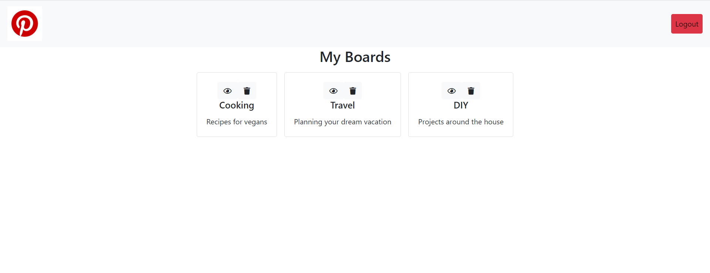
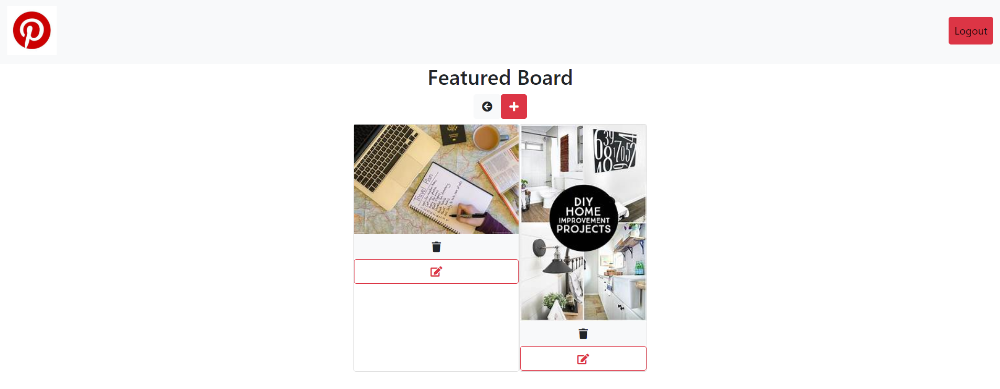

# Pinterest
## Description
This project is modeled after the website Pinterest.  It allows users to create new boards of interest.  When they find a picture they want to use as inspiration on one of their boards, they are able to create a "pin" that allows them to pin the picture to that particular board.  They can also move pictures or "pins" to a different board they have already created.  They can delete boards or pins at anytime!  
This project was completed and deployed employing Firebase.  This project also used the Axios library to complete the Promises needed, as well as API calls. Other technologies used in this project were JQuery and ES6 module methods.
## Screenshots
This is the main page of the application:

This is a featured board create by the user:

## How To Run
1. Clone down this repo
1. Make sure you have  http-serve installed via npm. If not, get it [HERE](https://npmjs.com/package/http-server).
1. On your command line run `hs -p 9999`
1. In your browser go to `http://localhost:9999`

Or use this link to access the website: https://pinterest-45902.web.app
